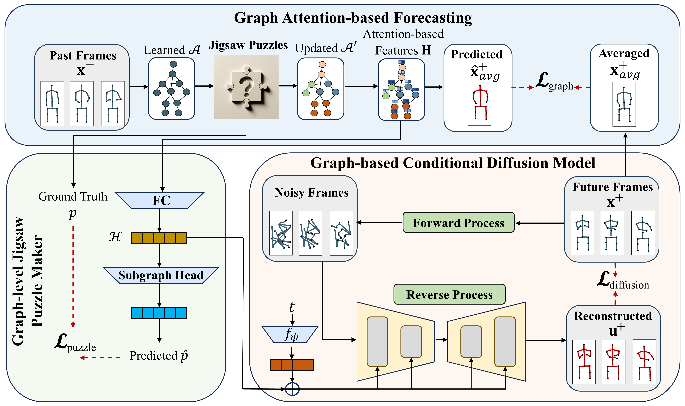

# Graph-Jigsaw Conditioned Diffusion Model for Skeleton-based Video Anomaly Detection
_Ali Karami, Thi Kieu Khanh Ho, Narges Armanfard_

### Description
This repository contains code and configurations for training and evaluating models on the HR-Avenue, HR-ShanghaiTech, and HR-UBnormal datasets. The code includes scripts for setting up the environment, training models, and evaluating their performance.

 

### Datasets
You can download the extracted poses for the datasets HR-Avenue, HR-ShanghaiTech, and HR-UBnormal from the following Google Drive link: [Dataset Link](https://drive.google.com/drive/folders/1JMQ4-KzFeWLdwbu7Gvo2_RtPOgYD1zKw?usp=sharing)

Place the extracted folders in a `./data` directory and update the configuration files accordingly.

### Training the Model
To train the model with all necessary dependencies, run the following script:
```sh
./GiCiSAD.sh
```
You may adjust the GPU configuration within the script to request additional GPUs as needed. The script includes the command:

srun python train.py --config config/STC/GiCiSAD_train.yaml

If you want to run the training on a single GPU, simply remove "srun" from the command.

### Training with Different Datasets
To train the model on different datasets, use the following command format:
```sh
python train.py --config config/[Dataset]/{config_name}.yaml
```
You can modify the model configuration by editing the corresponding YAML file in the config/[Dataset] directory.

### Model Evaluation
After training, you can test the model using the following command:
```sh
python eval.py --config checkpoints/HR-Avenue/train_experiment/config.yaml
```
The training configuration is saved in the associated experiment directory ("/args.exp_dir/args.dataset_choice/args.dir_name"). Set the following parameters in the configuration file to prepare for testing:

- split: 'Test'
- validation: 'False'
- load_ckpt: 'name_of_ckpt'

### Notes
Please ensure that all dependencies are installed and the configuration files are set up correctly before running the training or evaluation scripts.
